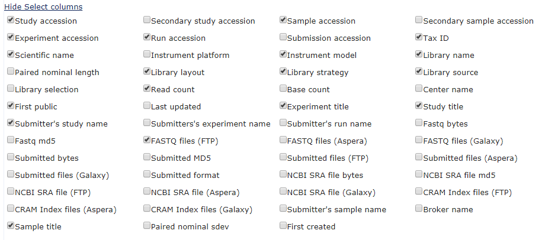

I have downloaded, mapped and counted reads over genes for 373
public RNA seq datasets. There are 2 biological replicates for each sample. 
The processing is detailed in a google drive markdown document 
https://drive.google.com/open?id=1mT7xdzzMvhn3HX5joY7xB5opygs2IZPr

The files SRRxxx_SRRxxx_counts_z_scores.txt_with_gene_name.txt
contain all the genes (that had counts), so around 20,000 genes. For each gene 
there is a quantitated value per sample, along with a z score, p-value and absolute z-score.
The z-scores and p-values have been calculated using an R script that runs the
intensity difference test from SeqMonk and gives each gene a z-score depending on 
it's position in the distribution.


1. Take the top 200 different genes and run them through a GO analysis.
2. Take genes that have a z-score higher than a certain threshold and re-run with these.

`for i in SRR*gene_name.txt; do head -n 201 $i | cut -f1 - | tail -n 200 > ${i}_top_200.txt; done
rename _counts_z_scores.txt_with_gene_name.txt_top_200.txt _top_200.txt *top_200.txt`

Get some GO category stats for the suspect GO categories - that was the main idea behind this package


# Experimental data


Large scale RNA-sequencing experiments are used to determine which genes are active in different biological systems, and to identify genes whose activity changes in response to stress, drug treatment or other biological interventions. The datasets produced are often made publicly available on websites. Having access to a large number of these experiments allows the data to be examined for patterns which may not be visible from looking at a single experiment, and can help to improve the way new data sets are analysed.


In this part of the project, an analysis of existing public RNA-seq data was performed. Samples that were labelled as pairs of biological replicates (where no true biological differences would be expected) were compared to find genes that appeared to change the most. Any genes found from this type of analysis are likely to be the result of technical problems with the collection of the data or errors in the programs used to process or analyse it. 


## Public RNA-seq data


### Locating suitable RNA-seq data samples


The European Nucleotide Archive (https://www.ebi.ac.uk/ena) contains sequencing data. It can be accessed via a web browser, through an API, and ftp download. To find datasets to download, the Advanced Search query was used. The Read domain was selected and datasets were filtered by taxon name, library layout, instrument platform and library strategy to build up the following query: tax_eq(10090) AND library_layout="SINGLE" AND instrument_platform="ILLUMINA" AND library_strategy="RNA-Seq". This found 158,363 experiments, 3809 studies and 215,495 runs. 
The Run records provide the location of fastq files. The information provided for each sample could be customised. To obtain information including sample name and location of fastq files, the options were selected as shown in the picture. 





This provided a text file that could be downloaded that included all the required information about the samples. 
Of the almost 200,000 samples listed, only a fraction were appropriate for the analysis. To filter the file for suitable samples a number of steps were taken.
Using bash and awk scripting, the text file was searched for samples that had 2 biological replicates, and the links to the fastq files were extracted.
Samples that were annotated as single cell RNA-seq or technical replicates were removed as these wouldn't work in the same way.


The script to find appropriate samples: `./filter_pairs_get_fq_links.sh ena_single_end.txt`               
After filtering, 3250 samples remained.           
                 
                 
### Download and mapping of the RNA-seq data
                
The RNA-seq data was mapped against the mouse genome GRCm38 using hisat2. A pipeline - clusterflow - was used which allows a list of ftp links to be provided, and will then download the files to map.

`cf --genome GRCm38 --file_list ena_single_ended_fq_links_batch1.txt fastq_hisat2`

The output of this command is a set of bam files which contain the mapped data.                  
                        
                                         
### Getting counts over genes

To quantify the number of reads over genes, htseq-count was used. htseq-count is a python package that requires a set of reads mapped to the genome, along with a set of defined regions (in this case genes). It then counts how many reads fall within the regions. For this analysis, a gtf file that defines all the genes in the genome was used. Only reads that map unambiguously to a gene are counted. 
A wrapper around htseq was used to sort the bam file before htseq could count the number of reads over each gene. The directionality of libraries is not usually specified in the metadata,  so although it meant losing some information, the libraries were all assumed to be non-directional.
`for i in *bam; do qsub -cwd -V -l h_vmem=16G -N htseq sh ../htseq_wrapper.sh $i;done`

The output of this is a text file, the first column containing the gene name, and the second column containing the number of reads that mapped to that gene.
                           
                 
                                          
### Finding the most highly variable genes between replicates

The htseq results were combined in to one file per pair. This required the pair information to be extracted from the original ENA file. A custom bash script was used to do this.
`sh ~/bi/scratch/Summer/extract_pairs_for_R_analysis.sh /bi/scratch/Summer/data_mapping_batch1`


An R script was then used to compare the 2 replicates and find the genes that changed the most between the 2 replicate samples. A read count correction was performed, and the data was log2 transformed. It was then sorted by average value between the conditions, and the highest z-scores from the local distribution were extracted. 

`for i in *counts.txt; do qsub -cwd -V -l h_vmem=10G Rscript /bi/scratch/Summer/changingGenes.r $i; done`

**Explain the intensity difference test**


The R script produces a list of genes with values and z-scores, along with a scatterplot showing the value for each gene, with the top 200 most different genes highlighted in red. 


combine the png scatter plots in to one pdf
`convert -adjoin *counts_scatter.png scatters.pdf`
                
                
### Annotating gene names

HTSeq uses Ensembl ids, so to add the offical gene name a custom script was used  

`for i in *counts_z_scores.txt; do qsub -cwd -V -l h_vmem=10G -N annotate_names_${i} /bi/scratch/Summer/gene_name_wrapper.sh ${i}; done`
                      
                    
### Extracting most frequently occurring genes
  
extract top 20 genes from each set of replicates and put them all in a file, then use something to count them
`echo "" > top20_genes.txt; for i in *_with_gene_name.txt; do head -n 21 $i | cut -f1 - | tail -n 20 >> top20_genes.txt; done`
                  
                  

small R script to count how many times the genes appeared
`Rscript ~/scripts/gene_frequencies.r top20_genes.txt`


```{r}
library("devtools")
#load_all("C:/Users/bigginsl/Documents/GOcategoryStats")
load_all("M:/GOcategoryStats")
```
                  
                     
                                       
### The 200 genes from each pair of samples that have the highest z-scores
                       
```{r}
#files <- list.files(path = "D:/projects/biases/public_data/top_200", pattern = "top_200.txt", full.names = TRUE)
files <- list.files(path = "M:/biased_gene_lists/public_data/top_200", pattern = "top_200.txt", full.names = TRUE)
top200 <- lapply(files, function(x) scan(x, what = "character"))

genfo <- read.delim("M:/biased_gene_lists/Mus_musculus.GRCm38.94_gene_info.txt")
bg_genes <- as.vector(unique(genfo$gene_name))
```
                  
                  
There are 373 sets of genes here so I don't want to examine each of the gene lists.
I'll run them through a GO overrepresentation analysis.
                    
                    
```{r, eval=FALSE}
go_results <- overrep_test(all_go_categories, top200[[1]], bg_genes)
head(go_results)

public_data_results <- lapply(top200, function(query){
  overrep_test(all_go_categories, query, bg_genes)
})

#save(all_go_results, file = "D:/projects/biases/public_data/all_go_results.rda")
save(all_go_results, file = "M:/GOcategoryStats/data/all_go_results_closest_gene.rda")
# took 7-8 mins to run for 373 datasets so I'm saving the file rather than
# re-running this every time it gets knitted.
```
   
 
```{r}
load("M:/GOcategoryStats/data/all_go_results.rda")
all_sig_categories <- unlist(sapply(all_go_results, rownames))
tabled_categories <- table(all_sig_categories)
ordered_categories <- tabled_categories[order(tabled_categories, decreasing = TRUE)]
```

```{r eval=FALSE}
filename <- paste0("GO_summary_", length(top200), "_datasets.txt" )
write.table(x = ordered_categories, filename, quote = FALSE, row.names = FALSE, sep = "\t")
```

Now we could do with some stats to pick a cutoff for the number of times a 
category appears. Let's just select an arbitrary value of 50 for now....

### Create a dataset that contains these suspect set of categories
```{r}
suspects_top200 <- ordered_categories[ordered_categories >= 50]

# convert to proportions 
suspects1 <- signif(suspects_top200/length(top200), digits = 2) 

# just save the names
suspects1 <- names(suspects1)

head(suspects1)
```


```{r, eval=FALSE}
save(suspects1, file = "M:/GOcategoryStats/data/suspects1.rda")
```


Have a quick look at the genes in the top categories
```{r, eval = FALSE}
file_location <- "http://download.baderlab.org/EM_Genesets/current_release/Mouse/symbol/Mouse_GO_AllPathways_no_GO_iea_March_01_2019_symbol.gmt"

functional_categories <- process_GMT(file_location, max_genes = 20000)
which(names(functional_categories) %in% names(suspects1[1]))

# Look up the genes from the category
# get the genes from the top category
top_cat <- get_GO_sets(names(suspects1)[1], functional_categories)
top_cat <- top_cat[[1]]

# plot lengths
#query_lengths <- get_lengths(query_filt, gene_info)

gene_info <- parse_GTF_info(m_musculus)
head(gene_info)

bg_lengths <- get_lengths(bg_genes, gene_info)

top_cat_lengths <- get_lengths(top_cat, gene_info)

my_plotting_data <- list(background = bg_lengths, top_cat = top_cat_lengths)
density_plot(my_plotting_data, log = TRUE, main  = "gene lengths")


for (i in 1:5) {
  top_cat <- get_GO_sets(names(suspects1)[i], functional_categories)
  top_cat_lengths <- get_lengths(top_cat[[1]], gene_info)

  my_plotting_data <- list(background = bg_lengths, top_cat = top_cat_lengths)
  density_plot(my_plotting_data, log = TRUE, main  = "gene lengths")
}


```

```{r, warning = FALSE, eval = FALSE}
bg_chr <- get_chromosomes(bg_genes, gene_info)
top_cat_chr <- get_chromosomes(top_cat, gene_info)

chr_list <- list(background = bg_chr, top_cat = top_cat_chr)

chr_proportions <- get_chr_percentage(chr_list)

bar_plot(chr_proportions, main = "chr", col = topo.colors(ncol(chr_proportions), alpha = 0.5), cex_names = 0.6)
```


### Create another set of suspects but using a z-score cut-off as some of the 
replicates had very tight distributions so we may not want to include those.
I'm not sure about this - I'm going to leave it for now.

use awk to filter in unix
`echo "" > z5.txt
for i in *_gene_name.txt; do awk '$7>5 {print $1}' $i >> z5.txt ; done`

This would work in a different way as there could be wildly varying numbers of 
genes per dataset. This would be more of a case of getting a list of suspect genes
rather than suspect categories, and then maybe generating a set of suspect categories 
from the genes.

```{r, eval = FALSE}
zfile <- "D:/projects/biases/public_data/top_zscores/z5.txt"
z5 <- scan(zfile, what = "character")

x_ordered <- table(z5)[order(table(z5), decreasing = TRUE)]


df <- data.frame(x_ordered)
colnames(df) <- c("gene_name", "count")
```


